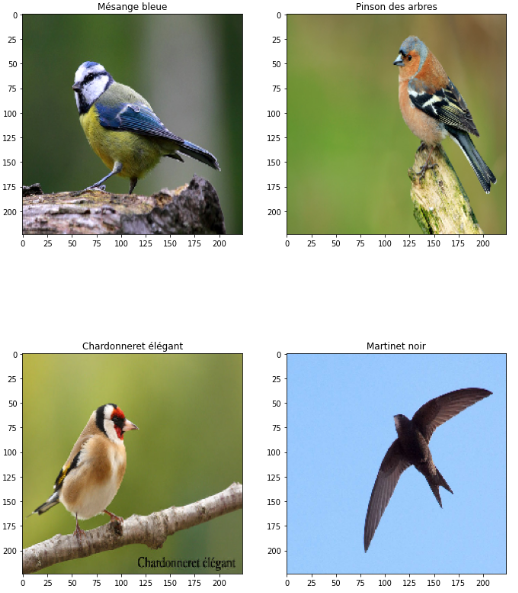

# Bird_Classifier_Tensorflow_Colab_notebook
Bird Classifier developped in tensorflow using pre-trained model from Tensorflow Hub and running on Google Colab

## Description
This classifier runs using a pre-trained model based on MobileNet architecture and available in Tensorflow Hub: https://tfhub.dev/google/aiy/vision/classifier/birds_V1/1

The model takes RGB images as input and predict the bird type out of 964 different species.

The notebook was developped on google colab with tensorflow and benefits from cloud resources integration with tensorflow hub.

# Installation

- download files to your colab folder in your google drive
- authentificate your google drive
- insert your own images in the "images" folder created in your google colab folder
- set the output language from bird species (fr or en)
`lang='fr'`
- run the notebook in google colab

## Notebook content
- Transform images
- Load and assemble pretrained model
- Load labels
- Run predictions

## Results

